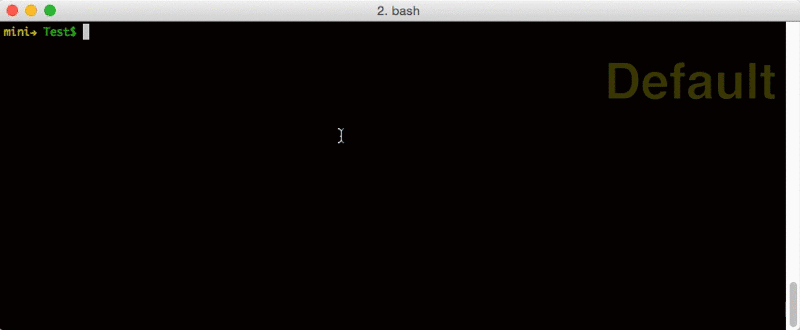

# Commitizen-go
> Command line utility to standardize git commit messages, golang version.



Contents
- Getting Started
- Usage

## Getting Started
### installation with Homebrew:
```
$ brew tap lintingzhen/tap
$ brew install commitizen-go
$ sudo commitizen --install
```
### installation with source code:
```
$ make && make install
```
or 
```
$ make && ./commitizen --install
```
### commit with commitizen
```
$ git cz
```

## Usage
```
Usage: commitizen
       or
       git cz after install

Options:
    -a, -all        Tell the command to automatically stage files that have been modified and deleted, but new files you have not told Git about are not affected
    -i, -install    Install this tool to git-core as git-cz
    -d, -debug      Debug mode
    -v, -version    Print version information and quit
```
